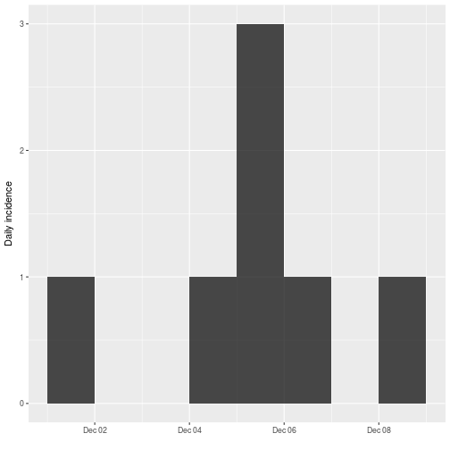
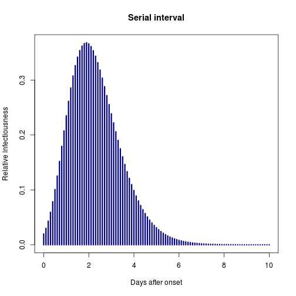

[](https://travis-ci.org/reconhub/projections)
[](https://ci.appveyor.com/project/thibautjombart/projections/branch/master)
[](https://codecov.io/github/reconhub/projections?branch=master)
[](https://cran.r-project.org/package=projections)


# Welcome to the *projections* package!

This package uses data on *daily incidence*, the *serial interval* (time between
onsets of infectors and infectees) and the *reproduction number* to simulate
plausible epidemic trajectories and project future incidence. It relies on a
branching process where daily incidence follows a Poisson process determined by
a daily infectiousness, computed as:

$$
\lambda_t = \sum_{s = 1}^{t - 1} y_s w(t - s)
$$

where $w()$ is the probability mass function (PMF) of the serial interval, and
$y_s$ is the incidence at time $s$.


## Installing the package

To install the current stable, CRAN version of the package, type:

```r
install.packages("projections")
```

To benefit from the latest features and bug fixes, install the development, *github* version of the package using:

```r
devtools::install_github("reconhub/projections")
```

Note that this requires the package *devtools* installed.


# What does it do?

The main features of the package include:

- **`project`**: a function generating projections from an existing *incidence*
  object, a serial interval distribution, and a set of plausible reproduction
  numbers ($R$); returns a `projections` object.
  
- **`plot`/`print`**: plotting and printing methods for `projections` objects.

- **`get_dates`/`get_incidence`**: accessors for `projections` objects.

- **`as.data.frame`**: conversion from `projections` objects to `data.frame`.


# Resources

## Worked example

In the following, we simulate a small outbreak with the following dates of
onset:

```r
onset <- as.Date(c("2017-12-01", "2017-12-04", "2017-12-05", "2017-12-05",
                 "2017-12-05", "2017-12-06", "2017-12-08"))
```

The package incidence is used to generate an epicurve:


```r
library(incidence)
i <- incidence(onset)
i
```

```
## <incidence object>
## [7 cases from days 2017-12-01 to 2017-12-08]
## 
## $counts: matrix with 8 rows and 1 columns
## $n: 7 cases in total
## $dates: 8 dates marking the left-side of bins
## $interval: 1 day
## $timespan: 8 days
```

```r
plot(i)
```



Let us assume the following serial interval distribution with a mean of 2.8 days
and a CV of +/- 0.4 days (in practice, these values would likely come from the literature):


```r
library(distcrete)
library(epitrix)
mu <- 2.8
cv <- 0.4
params <- gamma_mucv2shapescale(mu, cv)
params
```

```
## $shape
## [1] 6.25
## 
## $scale
## [1] 0.448
```

```r
si <- distcrete("gamma", shape = params$shape, scale = params$scale, interval = 1, w = 0)
si
```

```
## A discrete distribution
##   name: gamma
##   parameters:
##     shape: 6.25
##     scale: 0.448
```

```r
plot(si$d, xlim = c(0,10), type = "h", lwd = 3, col = "navy",
     main = "Serial interval", xlab = "Days after onset", ylab = "Relative infectiousness")
```



We also need to estimate transmissibility. For this, we use the function `get_R`
from the `earlyR` package:


```r
library(earlyR)
R <- get_R(i, si = si) # ML estimation
```

```
## Error in distcrete_d(d, x, log, strict): object 'MAX_T' not found
```

```r
R_samp <- sample_R(R, 100) # 100 plausible values of R
```

```
## Error in inherits(x, "earlyR"): object 'R' not found
```


We can now predict future incidence based on these data:


```r
library(projections)
pred <- project(i, R = R_samp, si = si, n_days = 14)
```

```
## Error in sample(R, n_sim, replace = TRUE): object 'R_samp' not found
```

```r
pred
```

```
## Error in eval(expr, envir, enclos): object 'pred' not found
```

```r
plot(pred) # median and 95% prediction
```

```
## Error in plot(pred): object 'pred' not found
```

```r
apply(pred, 1, mean) # average prediction per day
```

```
## Error in apply(pred, 1, mean): object 'pred' not found
```

```r
apply(pred, 1, range) # range across simulations
```

```
## Error in apply(pred, 1, range): object 'pred' not found
```

An alternative representation of the outcomes:

```r
library(ggplot2)
df <- as.data.frame(pred, long = TRUE)
```

```
## Error in as.data.frame(pred, long = TRUE): object 'pred' not found
```

```r
head(df)
```

```
##                                               
## 1 function (x, df1, df2, ncp, log = FALSE)    
## 2 {                                           
## 3     if (missing(ncp))                       
## 4         .Call(C_df, x, df1, df2, log)       
## 5     else .Call(C_dnf, x, df1, df2, ncp, log)
## 6 }
```

```r
ggplot(df, aes(x = date, y = incidence)) + geom_jitter(alpha = .3) + geom_smooth()
```

```
## Error in if (is.waive(data) || empty(data)) return(cbind(data, PANEL = integer(0))): missing value where TRUE/FALSE needed
```


## Vignettes

*projections* does not currently have a dedicated vignette; instead, it is illustrated in conjunction with `earlyR` on [this vignette](http://www.repidemicsconsortium.org/earlyR/articles/earlyR.html).


## Websites

A dedicated website can be found at:
[http://www.repidemicsconsortium.org/projections](http://www.repidemicsconsortium.org/projections).


## Getting help online

Bug reports and feature requests should be posted on *github* using the [*issue*](http://github.com/reconhub/projections/issues) system. All other questions should be posted on the **RECON forum**: <br>
[http://www.repidemicsconsortium.org/forum/](http://www.repidemicsconsortium.org/forum/)

Contributions are welcome via [pull requests](https://github.com/reconhub/projections/pulls).

Please note that this project is released with a [Contributor Code of Conduct](CONDUCT.md). By participating in this project you agree to abide by its terms.

